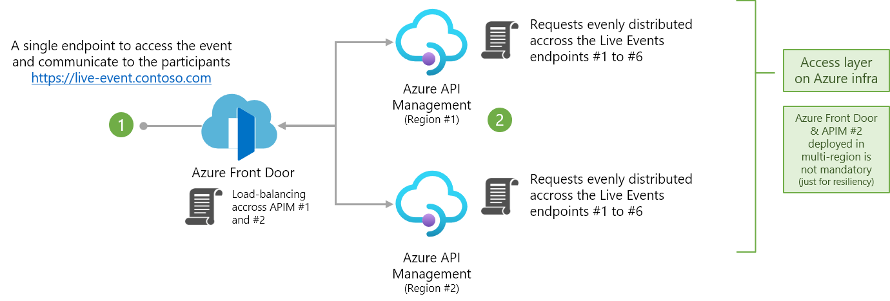
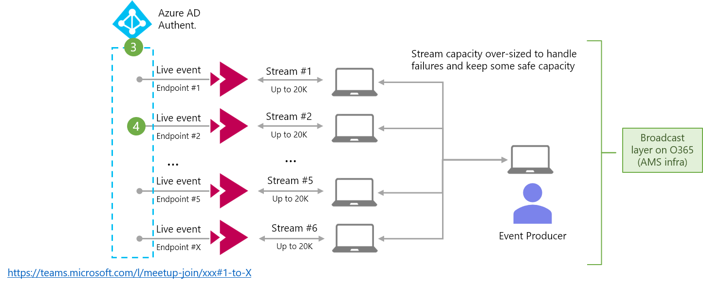
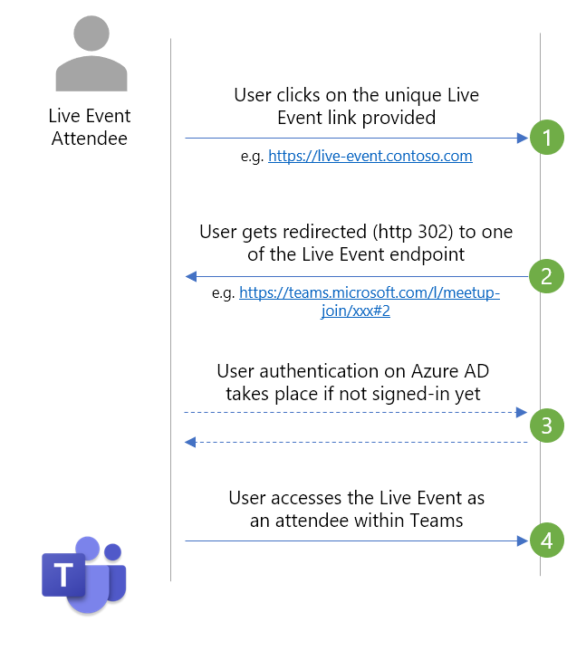

# Teams Live Event Traffic Distributor

## What it is

This solution was built to load balance users between a number of Microsoft Teams Live Events, since one Live Event can only host a couple of thousand clients (current limit of 20K attendees per Live Event stream) - For Live Events that need to go beyond this limit, the recommendation as of now is to publish the produced content across multiple streams, each of them having a different URL. This situation brings some complexity in terms of communication and management of the event as it requires to split the audience in pools of 20K users.

More info on setting-up a Teams Live Event can be found [here](https://docs.microsoft.com/en-us/microsoftteams/teams-live-events/plan-for-teams-live-events). 

The following solution covers this challenge by automatically distributing the Live Event URLs to the users from a unique URL. By default, this is the URL of Azure Front Door, e.g. `myliveevent.azurefd.net`, instead of a URL to the Teams Event directly. To achieve this load balancing, API Management is being used to randomly and evenly redirect client requests, using HTTP 302 status code, to one of the URL of the actual Live Event. Also, to manage the capacity and resiliency of the solution, we recommend to have a spare stream - e.g. for 100K participants, you'll need 6 streams (6 x 20K = 120K users max)


Note: The unique URL can be changed by either using a URL shortener like Bitly or also by adding your own custom domain to Front Door (e.g. `myliveevent.contoso.com`) - Check the documentation to [Configure HTTPS on a Front Door custom domain](https://docs.microsoft.com/en-us/azure/frontdoor/front-door-custom-domain-https)

## Azure Components

The solution deploys three components:

- Azure Front Door for global load balancing and failover
- 2x Azure API Management in Consumption tier, in two different regions for resiliency
- Azure Application Insights including on Azure Portal Dashboard for monitoring

<p align="center">
    <br>
    
    <br><br>
    
    <br><br>
    
</p>

## Alternative use cases

While the solution was originally built for Teams Live Events, it can easily be repurposed for any kind of similar load balancing where the backends are hosted on the same domain.

## How to use

### Build Bicep (optional)
[Build](https://github.com/Azure/bicep) bicep - if you didn't make any changes, you can also just use the main.json ARM template file from the repo which was already generated
```
bicep build main.bicep
```
### Deploy to Azure
Create resource group
```
az group create -n myresource-group -l northeurope
```

Deploy generated ARM template
```
az deployment group create -g  myresource-group --template-file .\main.json -p prefix=myprefix -p backends="https://stream1.teams.com,https://stream2.teams.com,https://stream3.teams.com"
```

Alternatively you can deploy through the Azure Portal directly:

[](https://portal.azure.com/#create/Microsoft.Template/uri/https%3A%2F%2Fraw.githubusercontent.com%2Fsebader%2Fteams-distributor%2Fmain%2Fdeployment%2Fmain.json)

## Costs 
(only provided as an example, as of Feb-2021)

Overall cost for this solution is pretty minimal. The only reoccurring billing (without any incoming traffic), is for the Front Door routing configuration. All other costs are purely based on incoming traffic / usage.

- API Management - Consumption tier: $3.50 per 1 million calls. And the first 1 million calls per Azure subscription are free. [Pricing](https://azure.microsoft.com/en-us/pricing/details/api-management/)
- Front Door: $0.01 per GB incoming traffic, $0.17 per GB response traffic (Zone 1), $22 per month for the two routing rules. [Pricing](https://azure.microsoft.com/en-us/pricing/details/frontdoor/)
- Application Insights: $2.88 per GB ingested data - and the first 5 GB per billing account are included per month. [Pricing](https://azure.microsoft.com/en-us/pricing/details/monitor/) 

The ARM template allows you to deploy the Azure services only for the preparation and duration of the Live Event. With a typical timeframe of 5 days and 100K attendees, the estimated cost of the solution is less than $5.